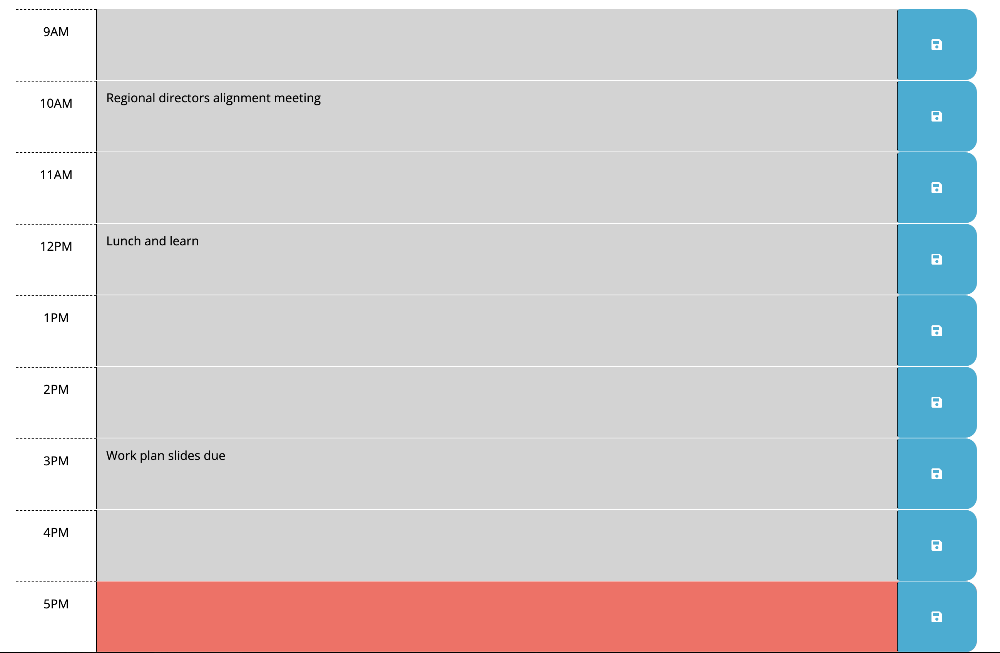

# work-day-scheduler

## Description

This project creates a work day scheduler for a typical 9-5 workday. This is great for users who need a current/focused view of their day. This is also ideal for those who like to lay out everything they need to do in the beginning of their work day, or for those who prep their schedule at the end of a shift for the next day. 

## Installation

Access the Work Day Scheduler [here](https://torfirst.github.io/work-day-scheduler/). A web browser is required to access the Work Day Scheduler. 

## Usage

Go to https://torfirst.github.io/work-day-scheduler/ to view the work day scheduler. To fill out information for a specific hour, simply click into the text field, type what you need, and hit the save button to the right of the text field. The text will remain when the page is refreshed. To clear the text, the user can go into the field they choose, delete everything inside the text area, and hit the save button on the right of the text field again. 

The current hour will show in red, while everything in the past will show grey and everything in the future will show green.

## Credits

I used the starter code HTML and CSS as a basis, and updated the HTML accordingly.

I also received guidance from the Xpert Learning Assistant located in BCS to remind me how to use the "this" function along with DOM traversal.

I used [this link](https://developer.mozilla.org/en-US/docs/Web/JavaScript/Reference/Global_Objects/String/split) to figure out how to split an ID and use the part I needed. I also referred to the [documentation for day.js](https://day.js.org/docs/en/installation/installation). 

## License

License in repo. 